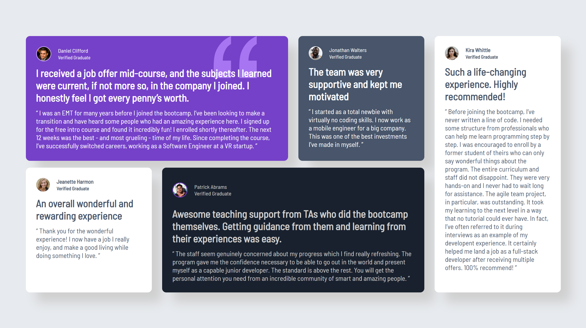

# Frontend Mentor - Testimonials grid section solution

This is a solution to the [Testimonials grid section challenge on Frontend Mentor](https://www.frontendmentor.io/challenges/testimonials-grid-section-Nnw6J7Un7). Frontend Mentor challenges help you improve your coding skills by building realistic projects.

## Table of contents

- [Overview](#overview)
  - [The challenge](#the-challenge)
  - [Screenshot](#screenshot)
  - [Links](#links)
- [My process](#my-process)
  - [Built with](#built-with)
  - [What I learned](#what-i-learned)
  - [Continued development](#continued-development)
  - [Useful resources](#useful-resources)
- [Author](#author)

## Overview

### The challenge

Users should be able to:

- View the optimal layout for the site depending on their device's screen size.

### Screenshot



### Links

- Solution URL: [Add solution URL here](https://your-solution-url.com)
- Live Site URL: [Add live site URL here](https://your-live-site-url.com)

## My process

### Built with

- Semantic HTML5 markup
- CSS custom properties
- Flexbox
- CSS Grid
- Desktop-first workflow

### What I learned

This project helped me improve my understanding of CSS Grid and how to structure more complex layouts with different columns.
I also learned how to manage absolute positioning for decorative elements and how to properly hide them on smaller screens:

```css
.quote-bcg-decoration {
  display: none;
}
```

One of the biggest takeaways was restructuring the layout for mobile screens using a clear and simple media query:

```css
@media only screen and (max-width: 768px) {
  main {
    grid-template-columns: 1fr;
    grid-template-rows: auto;
    gap: 30px;
  }
}
```

### Continued development

In future projects, I want to:

Become more comfortable with advanced Grid techniques

Apply a mobile-first approach more systematically from the start

### Useful resources

- [MDN Web Docs](https://developer.mozilla.org/) - Helped me for some commands I've forgot

### Author

- Frontend Mentor – [@zvko-3dg3](https://github.com/zvko-3dg3)

- GitHub – [@zvko-3dg3](https://www.frontendmentor.io/profile/zvko-3dg3)